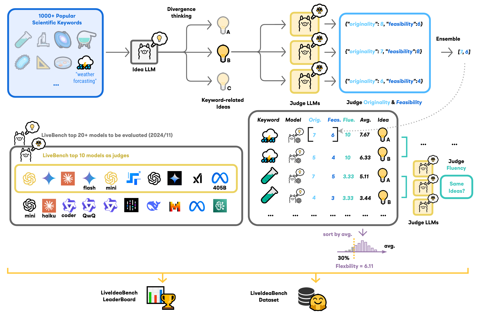
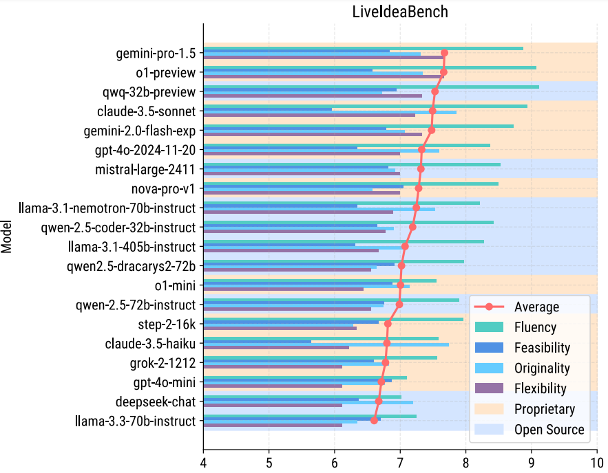

# 🤖💡 [LiveIdeaBench](http://liveideabench.com): Evaluating LLMs' Scientific Creativity and Idea Generation with Minimal Context


_"It's not like finding a needle in a haystack, it is like creating new needles."_


🏆 Leaderboard: http://liveideabench.com 💡

### Dataset

[](https://huggingface.co/datasets/6cf/liveideabench)

### Paper

[](https://arxiv.org/abs/2412.17596)


### 🧠✨🎉 News (2025/1/27): Latest Dataset Update on Hugging Face! 

We are excited to announce that the latest dataset, including supplementary tests for models like **deepseek-R1**, **deepseek-V3**, **minimax-01**, **phi-4**, and **Opus**, has been uploaded to Hugging Face! 🚀

Check it out here: [https://huggingface.co/datasets/6cf/liveideabench-DLC-250127](https://huggingface.co/datasets/6cf/liveideabench-DLC-250127)

---

## LiveIdeaBench Evaluation Framework



## Evaluation Instruction

### Database Initialization

The database will be automatically initialized the first time the program is run. If you modify the database structure (e.g., field changes), you need to reinitialize the database by following these steps:

1. Ensure that the `data` folder exists in the project root directory (if it doesn't exist, it will be created automatically).
2. Delete the old database file (if it exists):
   ```bash
   rm -f ./data/ideabench.db
   ```
3. Run the Python script to initialize the database:
   ```bash
   python -c "from utils.database import init_database; init_database()"
   ```

### Database Export

```bash
python view_database.py
```

### Configuring API Keys

Before running the program, you need to configure at least one API key:

1. Create an `apikey` file and write your OpenRouter API key:
   ```bash
   echo "your-openrouter-api-key" > apikey
   ```

   Alternatively, set environment variables:
   ```bash
   export OPENROUTER_API_KEY="your-openrouter-api-key"
   export STEP_API_KEY="your-step-api-key"
   export GEMINI_API_KEYS="key1,key2,key3"
   ```

### Running Examples

Generate and evaluate ideas using a specified model:

```bash
# Generate ideas using a specified model
python run.py --idea_model "openai/gpt-4o-mini"

# Use a specific provider
python run.py --idea_model "openai/gpt-4o-mini" --provider openrouter
```

```bash
# Use a single keyword:

python run.py --idea_model "openai/gpt-4o-mini" --keyword "relativity"
# Use multiple keywords:

python run.py --idea_model "openai/gpt-4o-mini" --keyword "relativity" "periodic table"
# Do not specify a keyword (use all keywords):

python run.py --idea_model "openai/gpt-4o-mini"
```

### Supported Model Providers

- openrouter (default)
- gemini
- stepfun
- ollama

### File Structure

- `run.py`: Main program
- `config.py`: Configuration management
- `utils/LLM.py`: LLM interaction and processing
- `utils/database.py`: Database management
- `utils/prompts.json`: Prompt templates


## Bibtex


```bibtex
@article{ruan2024liveideabench,
title={LiveIdeaBench: Evaluating LLMs' Scientific Creativity and Idea Generation with Minimal Context},
author={Kai Ruan and Xuan Wang and Jixiang Hong and Peng Wang and Yang Liu and Hao Sun},
journal={arXiv preprint arXiv:2412.17596},
year={2024}
}
```
