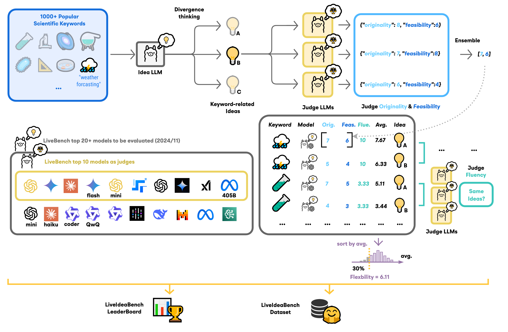
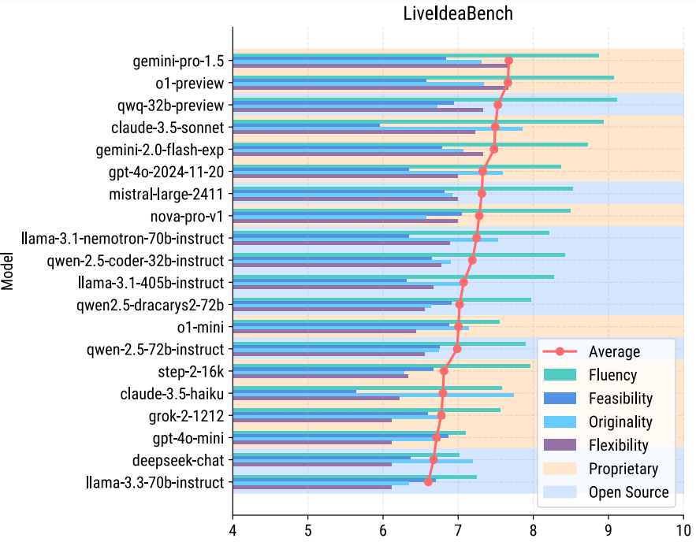

# 🤖💡 [LiveIdeaBench](http://liveideabench.com): Evaluating LLMs' Scientific Creativity and Idea Generation with Minimal Context


[](https://arxiv.org/abs/2412.17596)


[](https://github.com/x66ccff/liveideabench/blob/main/co2.ipynb)


_"It's not like finding a needle in a haystack, it is like creating new needles."_


🏆 Leaderboard: http://liveideabench.com 💡

### 🤗 Dataset

[](https://huggingface.co/datasets/6cf/liveideabench) [](https://huggingface.co/datasets/6cf/liveideabench-DLC-250127) [](https://huggingface.co/datasets/6cf/liveideabench-v2)


### 🧠✨🎉 News (2025/3/29): Latest Dataset Update (v2) on Hugging Face! 

We are pleased to announce that, based on the invaluable feedback from reviewers, we have enhanced our benchmark by upgrading it to **version 2**. This update introduces a new dimension—**Clarity**—and improves the prompts, evaluation process (including the rejection handling mechanism), making our benchmark more comprehensive and objective. 🚀

This v2 version of the benchmark incorporates the latest models, including: `claude-3.7-sonnet:thinking`, `o3-mini-high`, `gpt-4.5-preview`, `qwq-32b`, `deepseek-r1`, `gemini-2.0-flash-thinking`, and a total of **41** state-of-the-art models.

### 🧠✨🎉 News (2025/1/27): Latest Dataset Update on Hugging Face! 

We are excited to announce that the latest dataset, including supplementary tests for models like **deepseek-R1**, **deepseek-V3**, **minimax-01**, **phi-4**, and **Opus**, has been uploaded to Hugging Face! 🚀

---

## LiveIdeaBench Evaluation Framework



## 👇 Evaluation Instruction

### 1️⃣ Install Environment

```bash
pip install -r requirements.txt
```

### 2️⃣ Database Initialization

Run the Python script to initialize the database:
```bash
python -c "from utils.database import init_database; init_database()"
```

### 3️⃣ Configuring API Keys

Before running the program, you need to configure at least one API key:

1. Create an `apikey` file and write your OpenRouter API key:
   ```bash
   echo "your-openrouter-api-key" > apikey
   ```

   Alternatively, set environment variables:
   ```bash
   export OPENROUTER_API_KEY="your-openrouter-api-key"
   export STEP_API_KEY="your-step-api-key"
   export GEMINI_API_KEYS="key1,key2,key3"
   ```

### 4️⃣ Running Examples

Generate and evaluate ideas using a specified model:

```bash
# Generate ideas using a specified model
python run.py --idea_model "openai/gpt-4o-mini"

# Use a specific provider
python run.py --idea_model "openai/gpt-4o-mini" --provider openrouter
```

```bash
# Use a single keyword:

python run.py --idea_model "openai/gpt-4o-mini" --keyword "relativity"
# Use multiple keywords:

python run.py --idea_model "openai/gpt-4o-mini" --keyword "relativity" "periodic table"
# Do not specify a keyword (use all keywords):

python run.py --idea_model "openai/gpt-4o-mini"
```

### 5️⃣ Database Export

This step extracts the generated ideas, scores, and metadata from the internal database.

Run the script:

```bash
python view_database.py      
```

to extract the generated data from the SQL database.

Then, run `stats.ipynb`, to generate `data/data.parquet` which serves as input for the subsequent analysis notebooks.

### 6️⃣ Evaluate Fluency

Fluency measures the diversity and uniqueness of the generated ideas. This script calculates the Fluency score based on the processed data.

Run the script:

```bash
python hash.py
```

### 7️⃣ Compute Flexibility & Plotting

Flexibility evaluates whether the model's generated ideas span across diverse scientific disciplines based on the input keyword(s).

This notebook calculates the Flexibility score and creates visualizations of the benchmark results.

Run the Jupyter Notebook:  `stats_flexibility.ipynb`

Generated figures can be found in the `./figs` directory.

## 🌍🌱 CO2 Emission Estimation

This repo provides an estimation of the CO2 footprint associated with running the idea generation and evaluation pipeline.

Run the Jupyter Notebook: `co2.ipynb`


## Bibtex


```bibtex
@article{ruan2026evaluating,
  title = {Evaluating {LLMs}' divergent thinking capabilities for scientific idea generation with minimal context},
  author = {Ruan, Kai and Wang, Xuan and Hong, Jixiang and Sun, Hao and Wang, Peng and Liu, Yang},
  journal = {Nature Communications},
  year = {2026},
  month = {mar},
  day = {07},
  doi = {10.1038/s41467-026-70245-1},
  url = {https://doi.org/10.1038/s41467-026-70245-1}
}
```
