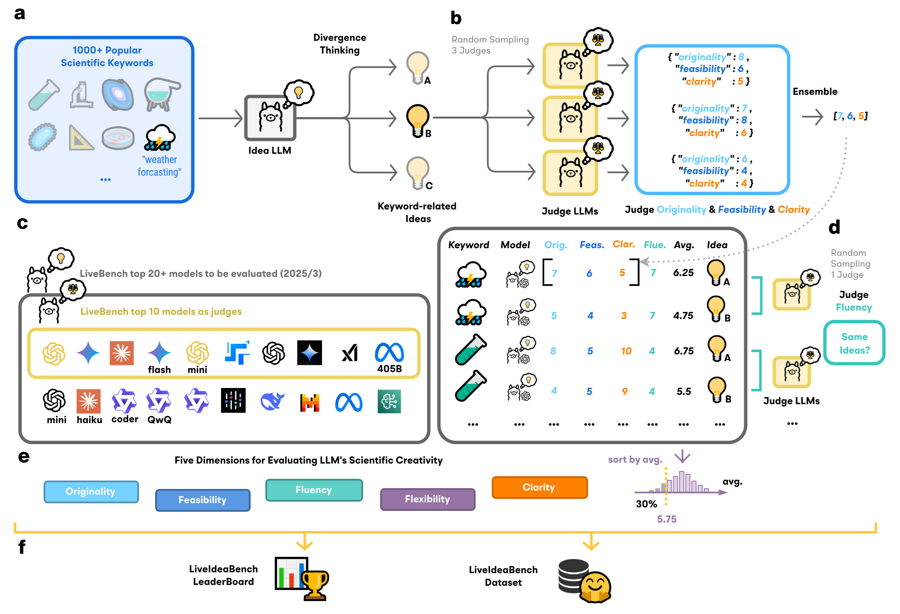
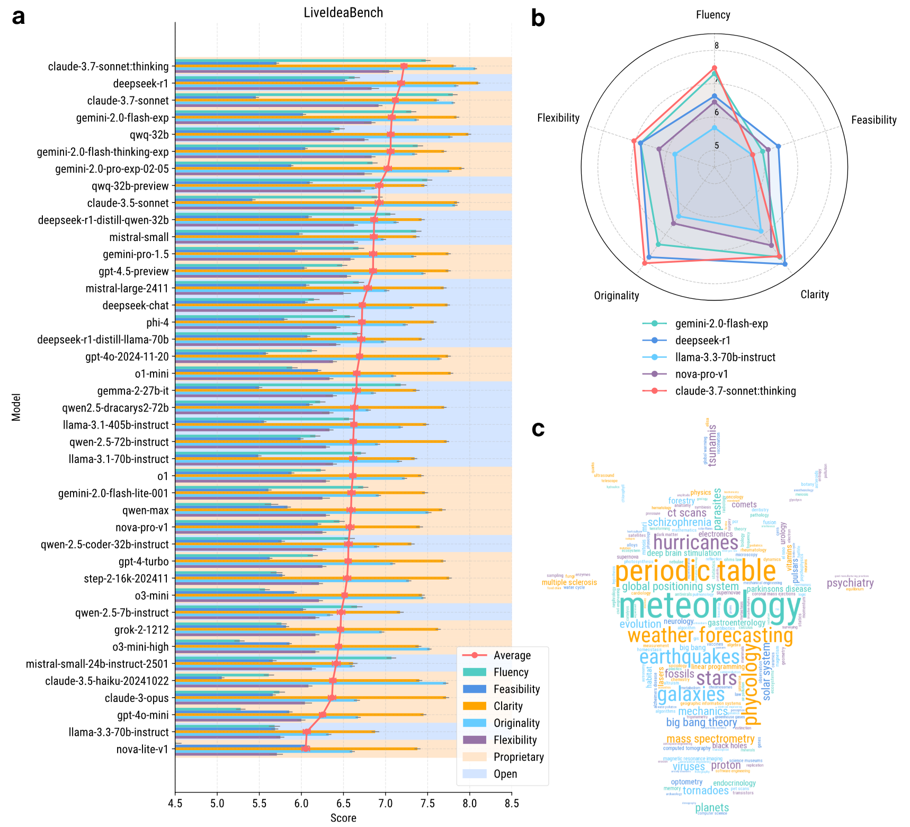

# 🤖💡 [LiveIdeaBench](http://liveideabench.com): Evaluating LLMs' Scientific Creativity and Idea Generation with Minimal Context


_"It's not like finding a needle in a haystack, it is like creating new needles."_


Leaderboard: http://liveideabench.com

### Dataset

[](https://huggingface.co/datasets/6cf/liveideabench)

### Paper

[](https://arxiv.org/abs/2412.17596)


### 🧠✨🎉 News (2025/1/27): Latest Dataset Update on Hugging Face! 

We are excited to announce that the latest dataset, including supplementary tests for models like **deepseek-R1**, **deepseek-V3**, **minimax-01**, **phi-4**, and **Opus**, has been uploaded to Hugging Face! 🚀

Check it out here: [https://huggingface.co/datasets/6cf/liveideabench-DLC-250127](https://huggingface.co/datasets/6cf/liveideabench-DLC-250127)

---

## LiveIdeaBench Evaluation Framework




## 🏆LiveIdeaBench💡 (2024-12)


|   Rank | Model                                  |   Fluency |   Feasibility |   Originality |   Flexibility |   Average | Open   |
|-------:|:---------------------------------------|----------:|--------------:|--------------:|--------------:|----------:|:-----------------|
|      1 | google/gemini-pro-1.5                  |      8.88 |          6.84 |          7.31 |          7.67 |      7.67 | 🔒            |
|      2 | o1-preview                             |      9.07 |          6.58 |          7.34 |          7.67 |      7.66 | 🔒            |
|      3 | qwen/qwq-32b-preview                   |      9.12 |          6.94 |          6.73 |          7.33 |      7.53 | ✅             |
|      4 | anthropic/claude-3.5-sonnet            |      8.93 |          5.95 |          7.86 |          7.22 |      7.49 | 🔒            |
|      5 | google/gemini-2.0-flash-exp:free       |      8.72 |          6.78 |          7.07 |          7.33 |      7.48 | 🔒            |
|      6 | openai/gpt-4o-2024-11-20               |      8.37 |          6.34 |          7.59 |          7    |      7.33 | 🔒            |
|      7 | mistralai/mistral-large-2411           |      8.52 |          6.82 |          6.92 |          7    |      7.31 | ✅             |
|      8 | amazon/nova-pro-v1                     |      8.5  |          7.05 |          6.57 |          7    |      7.28 | 🔒            |
|      9 | nvidia/llama-3.1-nemotron-70b-instruct |      8.21 |          6.34 |          7.54 |          6.89 |      7.24 | ✅             |
|     10 | qwen/qwen-2.5-coder-32b-instruct       |      8.43 |          6.65 |          6.9  |          6.78 |      7.19 | ✅             |
|     11 | meta-llama/llama-3.1-405b-instruct     |      8.28 |          6.31 |          7.04 |          6.67 |      7.07 | ✅             |
|     12 | abacusai/qwen2.5-dracarys2-72b   |      7.98 |          6.91 |          6.64 |          6.56 |      7.02 | ✅             |
|     13 | openai/o1-mini                         |      7.55 |          6.88 |          7.15 |          6.44 |      7    | 🔒            |
|     14 | qwen/qwen-2.5-72b-instruct             |      7.9  |          6.75 |          6.74 |          6.56 |      6.99 | ✅             |
|     15 | step-2-16k                             |      7.97 |          6.67 |          6.28 |          6.33 |      6.81 | 🔒            |
|     16 | anthropic/claude-3.5-haiku             |      7.58 |          5.64 |          7.74 |          6.22 |      6.8  | 🔒            |
|     17 | x-ai/grok-2-1212                       |      7.56 |          6.6  |          6.83 |          6.11 |      6.78 | 🔒            |
|     18 | openai/gpt-4o-mini                     |      7.1  |          6.87 |          6.76 |          6.11 |      6.71 | 🔒            |
|     19 | deepseek/deepseek-chat                 |      7.02 |          6.37 |          7.19 |          6.11 |      6.67 | ✅             |
|     20 | meta-llama/llama-3.3-70b-instruct      |      7.25 |          6.7  |          6.35 |          6.11 |      6.6  | ✅             |


## Bibtex


```bibtex
@article{ruan2024liveideabench,
title={LiveIdeaBench: Evaluating LLMs' Scientific Creativity and Idea Generation with Minimal Context},
author={Kai Ruan and Xuan Wang and Jixiang Hong and Peng Wang and Yang Liu and Hao Sun},
journal={arXiv preprint arXiv:2412.17596},
year={2024}
}
```
